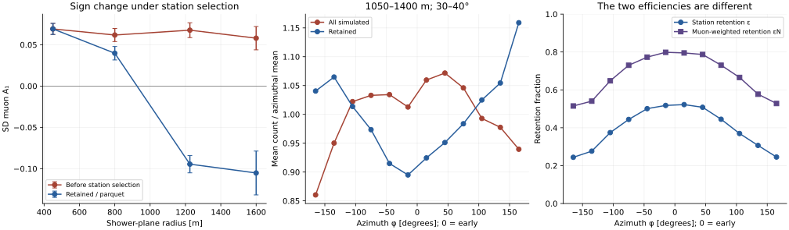

# SD–UMD azimuthal asymmetry: a transport and observable audit

Referee-style working report • 10 September 2026 • SIBYLL 2.3e proton, icrc2025-test7

## Verdict

The investigation changes the question. The negative SD coefficient in the existing parquet is **not a measurement of the unconditional incident-muon density**. The reader requires an SD reconstructed station before retaining its truth count. Directly reading the original ADST, including simulated stations that fail this requirement, provides a counterfactual test of that selection. Its result is reported below, together with a paired shower bootstrap. This is different from the already-settled unequal-bin-population bootstrap: selection changes a conditional mean; merely reducing the number of rows within an already-selected bin does not.

**Established result, all 20 matched production files:** at 1050–1400 m and 30–40°, the SD truth-count coefficient changes from **+0.0676 before station-reconstruction selection to −0.0945 afterward**. The paired difference is **−0.1622**, with a parent-shower bootstrap 95% interval **[−0.1784, −0.1453]**. Positive means early excess. The selected value reproduces the parquet exactly; the pre-selection coefficient is positive. Thus the sign inversion is induced by this selection in the tested production, without requiring negative pre-selection SD station-count asymmetry.

The source audit also resolves the most sharply posed detector question. `GetNumberOfMuons()` is an upstream **injected-trajectory intersection counter**, not a Cherenkov-response-weighted count. Water-generated muons, optical thresholds, capture, and reconstructed signal cuts do not enter its increment. However, water response and station reconstruction can affect whether that count appears in the parquet. These two statements are compatible and must not be conflated.

There is still no validated, parameter-free analytic prediction of both detectors from production physics. The old SD prediction remains an inadequate model benchmark, not a proof that an additional atmospheric mechanism of amplitude −0.29 exists. In particular, the old calculation extrapolates a production power law into an energy range where Cazon explicitly rejects it, neglects decay and energy loss, and uses ground-detector thresholds as production-energy limits. Its UMD agreement is numerically reproducible but not a validation of those assumptions.

**Recommended thesis decision:** retain the measured detector-observable comparison, but do not present the selected SD sign inversion as an established inversion of the unconditional ground muon density. Include the sample-selection audit before drawing a transport conclusion. Retain a compact, clearly conditional derivation of the competing geometric/ADF terms; remove claims that the present analytic model quantitatively explains both detectors, or has already isolated a new late-favoring atmospheric effect.

Throughout this report, **established** means an exact identity, a source-code fact within the audited implementation, or a directly computed MC result. **Model inference** means a result conditional on explicit assumptions. **Hypothesis** means a mechanism not causally identified by the available test. No atmospheric-production simulation was launched.

## 1. Observable, signs, and units

We use

\[
\rho(r,\phi)=\rho_0(r)[1+A_1(r)\cos\phi],\qquad
\phi=0\ \text{early},\quad \phi=\pi\ \text{late}.
\tag{1}
\]

Thus positive \(A_1\) is an early excess. Shower-plane radius, not horizontal ground radius, is held fixed. The production-facing shower axis points upward. With its ground projection chosen along positive horizontal \(x\), a point on that side is below the axis and is the early point. The reader rotates the station-minus-true-core vector by \(-\varphi_{\rm shower}\) and \(-\theta\); its unshifted azimuth has this convention. The stored Euler column contains an extra \(+\pi\), which we undo. This agrees with `plots_seccion_6.py` without using the observed sign to calibrate it. The raw ADST/parquet comparison checks the angles numerically.

For a general azimuthal distribution, the Fourier coefficient is

\[
A_1=\frac{2\int_{-\pi}^{\pi}\rho(\phi)\cos\phi\,d\phi}
{\int_{-\pi}^{\pi}\rho(\phi)\,d\phi}.
\tag{2}
\]

The endpoint contrast \(C=[\rho(0)-\rho(\pi)]/[\rho(0)+\rho(\pi)]\) equals \(A_1\) only for an appropriate first-harmonic shape. The previous analytic scripts primarily report \(C\); the parquet uses a fit to twelve bin means. Both quantities are calculated here. Their small numerical difference cannot explain the SD discrepancy.

The reported GAP-note comparison at nominal \(r\simeq1200\,\mathrm m,\theta\simeq35^\circ\) is UMD \(+0.11\), SD truth-muon count \(−0.10\). Those are reported benchmark values, not a new fit of identical bins. Our principal reproducible far-radius sample is \(1050\le r<1400\,\mathrm m\), \(30\le\theta<40^\circ\), \(17.5\le\log_{10}(E_0/\mathrm{eV})<18.0\), matching the previous verification script. Additional narrower bins are in `mc_fits.csv`.

Energy symbols are kept distinct: \(E_i\) is total energy at production, \(E_f\) total energy at ground, and \(T=E-m_\mu c^2\) kinetic energy. The total-energy floor \(0.155\,\mathrm{GeV}\) used in the previous illustrative integral is not a measured WCD detection threshold, nor an independent audit of this production's CORSIKA energy-cut card. For example, with the illustrative optical index \(n=1.33\), the Cherenkov condition gives \(p_{\rm Ch}=0.1205\,\mathrm{GeV}/c\), \(E_{\rm Ch}=0.1603\,\mathrm{GeV}\). Neither is an additional cut in the audited SD truth counter. See PDG §34.7.1, Eq. (34.41), and `derivation_checks.py`. [PDG, Passage of Particles Through Matter](https://pdg.lbl.gov/2024/reviews/rpp2024-rev-passage-particles-matter.pdf)

The detector material scales are not interchangeable: the nominal SD water height used here is \(1.2\,\mathrm m\), approximately \(120\,\mathrm{g\,cm^{-2}}\) vertically, while the illustrative UMD soil column is \(540\,\mathrm{g\,cm^{-2}}\). Water light production affects SD signals and selection, not its pre-water truth increment; soil transport directly affects the UMD crossing count. A threshold inferred from a WCD signal analysis therefore cannot be assigned to the UMD or silently added to `GetNumberOfMuons()`.

## 2. What the code actually counts

### 2.1 SD: the increment occurs before the water simulation

The locally available source tree `/opt/build/AugerOffline-icrc2025-test7` establishes this chain:

| Stage | Source and operation | Consequence |
|---|---|---|
| Ground-particle regeneration | `CachedShowerRegeneratorOG/CachedShowerRegenerator.cc`, around lines 570–638: projected injection area divided by projected resampling area; Poisson cloning or weight-dependent direct injection; `station.AddParticle(newParticle)` | The count is after shower-particle regeneration, not a direct sum of original CORSIKA weights. |
| Geometry gate | `Framework/SEvent/Station.cc:316–338`: `dStation.IsHit(position,direction)` then `CountParticle` | The intended straight trajectory must intersect the WCD water volume. |
| Species count | `Framework/SEvent/StationSimData.cc:43–57`: increment for muon or antimuon | No energy, optical, signal, timing, or source-ancestry test occurs here. |
| ADST serialization | `Modules/General/RecDataWriterNG/SD2ADST.cc:478–496` | `GenStation` receives that integer count. |
| Parquet selection | `Scripts/Procesamiento_ADST_v8-2.py:176–211` | A reconstructed SD partner is required before its simulated count is extracted. |

The exact source hashes are in `offline_source_manifest.json`. The ADST header reports a generic development version rather than a uniquely identifying build hash; the production-directory tag and source-tree tag agree, but this is not a binary provenance proof. The exact raw/parquet count agreement supplies an independent observable-level check.

The phrase *tank-boundary count* needs refinement. `Station::IsHit` tests an extrapolated line against the water cylinder before Geant4 propagates the candidate. It does not wait for a physical Geant4 crossing and could count an incident candidate whose subsequent interaction prevents that crossing. It also includes injected background muons if an upstream background injector is enabled. These qualifications do not turn it into a light-response counter. Station-level thinning of the particle list occurs separately: `AddParticle` stores/thins the simulation list, while `CountParticle` counts the candidate intersection. A stored particle list therefore need not reproduce the integer count without checking its thinning and geometry.

### 2.2 UMD: a different plane, transport, and first-crossing definition

`G4StationSimulator.cc:505–535` stores particles entering UMD scintillators. A muon increments `GetNumberOfInjectedMuons()` unless its source is `eCornerClipping`; repeat/adjacent-strip crossings are counted separately. `MD2ADST.cc` serializes this quantity. The parquet sums it over the channels of each retained module. Thus the UMD observable includes propagation through soil and a crossing convention that the SD pre-Geant4 intersection counter does not share.

This audit also corrects an overly broad suspicion in earlier notes: summing scintillator counts does **not automatically** double-count strip corner clippers, because the implementation explicitly distinguishes them. A proof of uniqueness across every module would require following the tagging logic and matching particle identities, not merely inspecting the accessor.

The same reconstructed-SD requirement selects the UMD rows. It does not follow that it biases UMD counts by the same amount. The SD count is directly associated with particles that generate the selecting tank signal; the underground count samples another area and a harder, soil-transported population. Their correlations with the selection differ.

### 2.3 The attempted UMD counterfactual: missing truth is not zero

The bounded one-file extraction contains 5,507 populated simulation-module records, **all associated with reconstructed SD stations**. Its truth totals reproduce all 7,632 corresponding parquet module rows after using the reader’s zero convention for the 2,125 absent retained-module summaries; every such retained parquet count is zero. In contrast, 2,752 SD simulation-station occurrences without reconstructed partners have no populated UMD module records. That is not evidence that their true underground injection is zero.

The source explains a concrete information-loss path. `MdOptoElectronicSimulator.cc:572–584` skips the module/channel path if the associated WCD has no accepted trigger and `forcedSDTrigger` is false. The inspected production header has `forcedSDTrigger = 0`. `G4StationSimulator::AddInjectedParticle` makes simulation scintillators, not electronic channels. Crucially, `MD2ADST::MakeSimCounter`, lines 610–618, serializes scintillator truth by iterating **event channels**, not all simulation scintillators. An existing simulated counter with no channels can therefore become an ADST object with an empty scintillator vector even after particles entered its soil/scintillator simulation.

**Established:** this pilot cannot support a pre-selection UMD harmonic by reading these summaries and zero-filling missing objects. **Source-based inference:** the trigger/channel serialization path can discard the required truth. It is not a proof that every missing counter contained an injected muon. A pre-electronics count summary, or serialization independent of channel creation, is the minimal remedy. The pilot and exact retained-count validation are reproducible with `umd_selection_read.py` and `umd_selection_check.py`.

## 3. Real-MC tests: selection is not exposure

### 3.1 Reproduction and robustness of the existing parquet

The scripts read only the supplied proton parquet directory and use true-core geometry. The twenty files contain a modest columnar dataset. The selected zenith/infill sample contains 156,633 module rows. The broad far-radius bin contains 33,312 module rows, representing 11,104 SD station occurrences. The SD count is repeated on the module rows; deduplicating by file, event and SD ID leaves its fitted central value unchanged.

| Check, far-radius sample | UMD \(A_1\) | SD truth muons \(A_1\) |
|---|---:|---:|
| Twelve bin means, unweighted harmonic fit | +0.0670 | −0.0945 |
| Common joint radius/energy/zenith distribution | +0.1220 | −0.0858 |
| Conservative parent-shower bootstrap, standard deviation of unweighted result | 0.0176 | 0.0115 |

The standardization uses twenty-eight joint cells: two energy intervals, seven radius intervals, and two zenith intervals, all with support in every azimuth bin. It is not a correction for stations absent from the parquet. It shows why the UMD benchmark should not be compared to an uncontrolled broad-bin mixture. It does not erase the SD inversion. The standardized coefficients have no bootstrap uncertainty assigned in this report; do not borrow the uncertainty from the unstandardized fit.

The conservative bootstrap groups repeated library-shower identifiers across files, rather than treating all module rows or reconstructed reuses as independent. There are 959 such groups in the far sample. Their identifiers are not a complete CORSIKA provenance certificate, so this is a conservative operational grouping. The SD confidence interval remains entirely negative. `parent_cluster_bootstrap.json` contains the quantiles. The SD sign is negative in each of four primary-azimuth quadrants, with central coefficients between −0.113 and −0.071; this does not exclude every geomagnetic contribution, but disfavors an explanation requiring only one arrival-direction sector.

### 3.2 The counterfactual available in the original ADST

The ADST contains `GenStation` entries even when no `SdRecStation` is present. We read those entries directly, derive radius/azimuth from detector geometry and the true core, and then apply precisely the station-presence condition used by the parquet reader. Physical SD IDs are used: for example SD 4002 corresponds to UMD counter 104002. The initial diagnostic mistakenly applied the UMD ID threshold to SD IDs; that unsuccessful pass yielded no selected stations and is not used as physics evidence. The corrected reader and its column-pruned implementation agree exactly on the pilot file.

| Shower-plane radius [m] | All simulated SD stations: A₁ | Retained/parquet: A₁ | Difference | All / retained stations |
|---|---:|---:|---:|---:|
| 300–600 | +0.0691 | +0.0691 | +0.0000 | 10,357 / 10,357 |
| 650–950 | +0.0618 | +0.0397 | −0.0220 | 17,730 / 17,250 |
| 1050–1400 | +0.0676 | −0.0945 | −0.1622 | 28,030 / 11,104 |
| 1400–1800 | +0.0580 | −0.1052 | −0.1632 | 38,432 / 1,837 |

The raw extraction contains 106,280 station occurrences in the audited radius range; 51,031 match retained parquet stations, with zero muon-count or EM-count mismatches and numerical agreement of radius/azimuth. In the far bin, the pre-selection 95% interval is [+0.0494, +0.0843], and the retained interval is [−0.1161, −0.0750]. The paired difference has bootstrap standard deviation 0.0087, using 960 parent-shower groups and 800 resamples. The confidence intervals are statistical, conditional on this production and grouping; they do not include hadronic-model or source-provenance uncertainty. The independently bootstrapped parquet interval in §3.1 differs slightly because its observed parent set and random resamples differ.

**Covariate control:** standardizing both raw samples to the same empirical distribution over 28 radius/energy/zenith cells gives +0.0695 before selection and −0.1095 afterward. The difference, −0.1790, is not erased by phase-space mixing. The secondary uncertainty diagnostic uses positive exponential parent-cluster weights to avoid conditioning a multinomial bootstrap on sparsely populated cells remaining nonempty. The primary quoted confidence interval remains the unstandardized paired result. `selection_narrow_bins.csv` also tests separate radial/zenith halves and a bin 1150–1250 m, 34–36°; the central SD sign changes from positive to negative in each. No separate significance claim is assigned to every narrower-bin fit.

The plotted uncertainties on the radial coefficients are parent-cluster bootstrap standard deviations. The azimuth-bin profiles are descriptive bin means; no independent-bin error bars are implied. Every curve is generated from the stored audit tables by `build_report.py`.

These are interventions on the *analysis selection of an already-simulated sample*: no shower or detector parameter was changed. This establishes the effect of applying that selection to this production. It does not identify a particular electronic trigger algorithm as the sole cause; `HasStation` represents the net upstream path to an ADST reconstructed-station object. Separate trigger/rejection flags are needed to split that path into individual causes.

The all-simulated-station result is still conditional on the shower events written to this ADST production and its regeneration/array configuration. It is not a measurement on all thrown CORSIKA showers and is not a direct ground-particle tally independent of detector regeneration. Those qualifications limit the word *unconditional* to **station reconstruction within the available ADST events**.

### 3.3 Exact selection identity and paired uncertainty

Let \(R\) denote row retention, \(N\) the SD truth count, and \(b\) an azimuth bin within the stated phase-space bin. Define

\[
\epsilon_b=P(R=1\mid b),\qquad
\epsilon_{N,b}=\frac{E[N\,1_R\mid b]}{E[N\mid b]}.
\]

Then, without a Poisson assumption,

\[
E[N\mid R=1,b]
=E[N\mid b]\frac{\epsilon_{N,b}}{\epsilon_b}.
\tag{3}
\]

The numerator is muon-weighted retention, the denominator station retention. `selection_closure_bins.csv` verifies Eq. (3) in each bin. It is an accounting identity, not an independent predictive fit. The nontrivial evidence is the measured change when previously absent stations are restored. The paired bootstrap uses the same resampled parent showers on both sides, and therefore estimates the uncertainty of that change directly.

For small harmonic distortions,

\[
A_{1,\rm selected}\simeq A_{1,\rm all}
+A_{1,\epsilon_N}-A_{1,\epsilon}.
\tag{4}
\]

Equation (4) is only a linear interpretation; the numerical closure uses full binwise ratios. Reweighting retained rows to equal azimuthal sample size leaves their conditional means unchanged and cannot undo Eq. (3). Consequently the previous bootstrap result is preserved in its proper, narrower scope.

### 3.4 A physically motivated selection model

Here is a concrete mechanism capable of the requested sign and scale, without introducing an atmospheric loss of negative sign. It is **a model inference**, motivated by the SD selecting signal and by the explicit trigger-efficiency treatment in the IceTop muon-density likelihood, not a fitted description of Auger electronics. IceCube Collaboration, *Phys. Rev. D* 106, 032010 (2022), §IV.B, Eqs. (4)–(6), models muon track lengths and low-signal acceptance. The load-bearing excerpt is: “the reduced efficiency for detecting low signals, caused by the discriminator trigger in each detector.” This factor is explicit in Eq. (6). IceTop tank/snow thresholds are not transferred to UMD or to the SD truth accessor. [IceTop analysis](https://arxiv.org/pdf/2201.12635)

Assume \(N\sim\operatorname{Poisson}(\mu(\phi))\), and an independent EM-related station acceptance probability \(e(\phi)\). In the simplest limiting model a station is retained if at least one muon is present or the EM condition succeeds. Then

\[
\epsilon(\phi)=1-[1-e(\phi)]e^{-\mu(\phi)},\qquad
E[N\mid R=1,\phi]=\frac{\mu(\phi)}{\epsilon(\phi)}.
\tag{5}
\]

An early EM excess can make station retention more asymmetric than the underlying muon intensity. Late stations that survive selection become more muon-rich. In this model the negative sign is a *conditional-composition effect*, not extra late muons produced by the tank.

More explicitly, let \(\mu=\mu_0[1+a\cos\phi]\) and \(e=e_0[1+b\cos\phi]\). For small (a,b), with \(\epsilon_0=1-(1-e_0)e^{-\mu_0}\),

\[
A_{1,\mathrm{selected}}\simeq a-
\frac{e^{-\mu_0}[(1-e_0)\mu_0a+e_0b]}{\epsilon_0}.
\tag{5a}
\]

For \(e_0>0\), the linearized inversion condition is

\[
b>\frac{a}{e_0}\{e^{\mu_0}-(1-e_0)(1+\mu_0)\}.
\tag{5b}
\]

The admissible parameter domain is \(\mu_0>0\), \(0<e_0<1\), \(|a|\le1\), \(|b|\le1\), and \(e_0[1+|b|]\le1\). Equations (5a)–(5b) apply only to the small-harmonic limit; for large \(b\), use the exact positive probabilities in Eq. (5), as in the example below. This is an explicit range/criterion, not a free negative attenuation coefficient.

For the explicitly illustrative parameters

\[
\mu=0.6(1+0.19\cos\phi),\qquad
e=0.35(1+0.8\cos\phi),
\]

the exact Fourier coefficient changes from \(+0.1900\) to \(−0.1287\). An underground count independent of the selecting tank counts at fixed shower state retains its assigned \(+0.13\). This provides an existence example of an SD-specific shift larger than −0.29. The independence is an assumption, not an established property of the actual UMD. These parameters were not obtained from the parquet, and their mean selected count does not match the data: do not present this as a quantitative Auger fit. The actual validation is the nonparametric ADST selection test above.

If a muon independently triggers with probability \(0<q<1\), thinning the Poisson distribution gives

\[
\epsilon=1-(1-e)e^{-q\mu},\qquad
E[N\mid R]=\mu\left[1+\frac{(1-e)q e^{-q\mu}}{\epsilon}\right].
\tag{6}
\]

This makes the mechanism continuous, not a peculiarity of a discontinuous one-muon cut. It is strongest at low occupancies and partial acceptance, and disappears when station retention is independent of local particle content or approaches unity. Applying a high *observed station signal* cut is not by itself a clean test: it imposes another condition on the same outcome. Prefer an independent efficient event selection followed by inclusion of all simulated station counts.

## 4. One consistent physical framework

### 4.1 Production, transport, detector response, and selection

Let \(F_q(X,E_i,\mathbf p_t,\mathbf x_\perp,t_i\mid H)\) describe muon production for shower state \(H\), including charge, off-axis production and correlations. Let \(K_q\) be the transport kernel to ground, including energy loss, decay, scattering and magnetic bending. It produces the incident phase-space intensity \(J_q(E_f,\Omega,\mathbf x,t\mid H)\). For an unselected detector observable,

\[
M_d(\mathbf x\mid H)=\sum_q\int J_q(E_f,\Omega,\mathbf x,t\mid H)
\,\mathcal R_d(E_f,\Omega,t,\ldots)\,dE_f\,d\Omega\,dt.
\tag{7}
\]

Here the SD count response includes the geometric intersection and regeneration definition; the UMD response includes transport through soil and its first-crossing definition; a VEM signal requires a light/track-length response. For a selected stochastic shower-detector realization, the observable is instead

\[
\overline M_{d,R}(b)=\frac{E[M_d\,1_R\mid b]}{P(R=1\mid b)}.
\tag{8}
\]

One cannot replace the numerator by \(E[M_d]P(R)\) unless their conditional independence is demonstrated. An independent atmospheric *source* such as a distinct photonuclear muon population belongs in \(F\); extra spreading belongs in \(K\); water-secondary response belongs in \(\mathcal R\), and sample retention belongs in \(R\). This assignment prevents counting a mechanism twice under different names.

### 4.2 Exact point-source geometry and its domain

For a source at axial distance \(D\), write

\[
\delta=r\tan\theta\cos\phi,\quad
L=\sqrt{(D-\delta)^2+r^2},\quad
\sin\alpha=\frac rL,\quad
\cos\vartheta=\frac{D\cos\theta}{L}.
\tag{9}
\]

\(\vartheta\) is the local incidence zenith, not the primary zenith. At the benchmark, \(L_{\rm early}=6767.0\,\mathrm m<L_{\rm late}=8426.1\,\mathrm m\); the early flux is more vertical. For an angular density \(f=dN/d\Omega\), the intensity per area normal to the ray is \(f/L^2\). Multiplying by the detector's projected area gives counts:

\[
M_{\rm plate}\propto \frac f{L^2}A_p\cos\vartheta,
\qquad
M_{\rm tank}\propto \frac f{L^2}
[\pi R^2\cos\vartheta+2RH\sin\vartheta].
\tag{10}
\]

For uniform through-going tracks with signal proportional to path length, the chord identity \(A_{\rm proj}\langle\ell\rangle=V\) instead gives \(S_\mu\propto fV/L^2\). Stopping tracks, energy-dependent light yield, signal windows and reconstruction invalidate using that identity as an exact detector-response model for every event.

### 4.3 What is, and is not, the “+1” geometric term

For a stationary cylindrically symmetric local phase-space distribution, flux through a tilted plane gives

\[
A_{\rm geo}=\left\langle\frac{p_r}{-p_z}\right\rangle_{\rm crossing}\tan\theta.
\tag{11}
\]

The subscript specifies crossing-flux weighting through the shower-normal plane, with \(p_z\) measured along the upward shower axis; an unqualified average of a ratio need not equal a ratio of unweighted means. \(p_r\) is the signed radial component, not the positive magnitude \(p_t\). Descending muons can have \(p_r<0\). In a small-angle ballistic point-source limit Eq. (11) is the plate-aperture \(+1\) contribution, approximately \((r/D)\tan\theta\). Do not add it again after using the plate area in Eq. (10).

**An important correction to the premise:** Armbruster's original Eq. (2.33), inherited by Luce, is derived for approximately muon-dominated **VEM signal** after cancellation of area and mean chord length in Eqs. (2.14)–(2.21). Its \(+2\) comes from the expansion of \(L^{-2}\), explicitly Eq. (2.29). It does not contain a separate plate-aperture \(+1\). Adding Eq. (11) to an already plate-weighted count double-counts projection; treating Armbruster's signal bracket as though it already contained the plate aperture is a different mistake. The reference is Lukas Armbruster, *Asymmetries of the Lateral Distribution of Particles at the Ground*, Bachelor thesis, circulated as GAP-2020-066, §§2.4–2.6; not a peer-reviewed muon-count derivation.

With \(\epsilon=(r/D)\tan\theta\), small angles, \(f\propto\alpha^{-\gamma_{\rm ADF}}\), and passive attenuation \(P=e^{-L/\lambda}\), Eq. (10) gives

\[
A_{1,d}\simeq[2-\gamma_{\rm ADF}+D/\lambda+\kappa_d]\epsilon,
\tag{12}
\]

where \(\kappa=0\) for the ideal through-going VEM signal, (1) for a horizontal plate, and for tank counts

\[
\kappa_{\rm tank}=\frac{a\cos\vartheta-b\cos^2\vartheta/\sin\vartheta}
{a\cos\vartheta+b\sin\vartheta},\quad a=\pi R^2,\ b=2RH.
\tag{13}
\]

At finite (r/D), put \(L_0=\sqrt{D^2+r^2}\), \(\eta=Dr\tan\theta/L_0^2\), and define \(s=-\partial\ln f/\partial\ln\sin\alpha\). The derivative at the transverse azimuth is \(\partial\ln M_d/\partial\cos\phi=\eta(2-s+\kappa_d)+\partial\ln P/\partial\cos\phi\), with detector-energy-boundary terms if the response threshold varies. The benchmark gives \(\eta=0.10924\), \(\kappa_{\rm tank}=0.3180\). In the no-loss local-slope model, SD \(−0.10\) requires \(s\simeq3.2335\); passive attenuation would require an even steeper ADF. This is a diagnostic requirement, not a measured production slope.

### 4.4 Attenuation and divergence cannot be added indiscriminately

Muon decay survival is

\[
P_{\rm surv}=\exp\left[-\frac{m_\mu c^2}{c\tau_\mu}
\int_0^L\frac{ds}{p(s)c}\right],\qquad
\frac{dE}{dX}=-(a+bE).
\tag{14}
\]

At fixed production phase-space point, shortening the path increases survival: its isolated contribution is early-favoring. But conditioning on arrival radius, ground energy and detector passage changes the contributing production population. The derivative of that population is not captured by a universal fitted attenuation length.

The same point can be expressed through a continuity equation for density \(n\) in a plane advancing along the shower:

\[
\partial_s n+\nabla_\perp\cdot\mathbf j_\perp=Q_\mu-\mathcal L_\mu.
\tag{15}
\]

The fixed-radius longitudinal derivative includes outward transport. If one uses an empirical \(\partial_s n\) obtained from densities at successive depths, it already includes lateral divergence. Adding another ballistic divergence term counts that contribution twice unless a source/loss/transport decomposition has been measured. Energy-thresholded versions of Eq. (15) also contain an energy-space boundary flux. This is why neither Bertou–Billoir Fig. 1 nor an unrelated muon attenuation length can be transferred to the UMD population or appended to the previous integral as a new negative loss term.

## 5. Cazon-based ADF: stronger derivation, limited numerical claim

### 5.1 Normalized angular law

For the separable illustrative distribution

\[
\frac{dN}{dp_t}\propto p_t e^{-p_t/Q},\qquad 0\le p_t\le p,
\]

the change \(p_t=p\sin\alpha\), \(d\Omega=2\pi\sin\alpha\,d\alpha\) gives

\[
f(\alpha\mid p)=\frac{k^2}{2\pi Z(k)}\cos\alpha\,e^{-k\sin\alpha},
\quad k=p/Q,\quad Z(k)=1-e^{-k}(1+k).
\tag{16}
\]

The angular integral is unity; `unit_checks.json` checks it independently. The local logarithmic slope is \(s=\tan^2\alpha+k\sin\alpha\). For a mixture, the derivative is the **arrival-contribution-weighted mean** of those slopes, including the appropriate survival and response weights. Averaging fixed-energy early/late ratios with a bare energy spectrum is not equivalent.

The proper straight-line integral is schematically

\[
M_d(r,\phi)=\int dX\,dE_i\;
\frac{h(X)g_X(E_i)f_X(\alpha\mid E_i)}{L(X,\phi)^2}
P(E_i,X,\phi)\,\mathcal A_d(E_f,\vartheta,\ldots).
\tag{17}
\]

The nonseparable form is Cazon et al., *Astroparticle Physics* 36 (2012) 211–223, Eqs. (2), (5), (25)–(26), with their correlated \(f_X(E_i,cp_t)\). Equation (16) is a useful separable approximation, not the full 2012 model. Their §2 explicitly says: “At low energies the single power law clearly does not work.” Their §3 includes energy loss, decay, magnetic deflection and multiple scattering. The full model cannot be represented accurately by citing only its earlier separable \(p_t\) ansatz. [Cazon et al., DOI](https://doi.org/10.1016/j.astropartphys.2012.05.017)

### 5.2 Reproduction of the decisive prior benchmark

Using exactly the prior assumptions \(D=7500\,\mathrm m\), \(Q=0.2\,\mathrm{GeV}/c\), \(g(E_i)\propto E_i^{-2.6}\), \(p c\simeq E_i\), upper limit \(2000\,\mathrm{GeV}\), no atmospheric transport, and the two old lower energy limits:

| Observable | Endpoint contrast | Full-azimuth Fourier \(A_1\) |
|---|---:|---:|
| SD count, lower limit 0.155 GeV | +0.19075 | +0.19308 |
| UMD plate count, lower limit \(\sec35^\circ\\) GeV | +0.13283 | +0.13345 |

This reproduces the important earlier result. The multiplicative endpoint factor needed to change the SD contrast to −0.10 is −0.28531, not exactly the additive difference −0.29075. The old untransported SD integral has median contributing production energy \(0.3283\,\mathrm{GeV}\), and a fraction (0.8287) below \(1\,\mathrm{GeV}\) at the transverse azimuth. These are properties of that integral, **not measured ground-muon energies**. Its low-energy population cannot simply travel the assumed axial distance unchanged.

### 5.3 Explicit transport sensitivity—not another unsupported Fast MC

`transport_checks.py` performs deterministic quadrature, not shower generation. It uses a fixed axial source, the normalized \(p_t\) law with exact \(p=\sqrt{E_i^2-m_\mu^2}\), an exponential atmosphere with ground vertical depth \(860\,\mathrm{g\,cm^{-2}}\) and scale height \(7400\,\mathrm m\), constant \(a=0.002\,\mathrm{GeV}\,(\mathrm{g\,cm^{-2}})^{-1}\), and numerical decay integration along the path. It integrates over **ground** energy with \(E_i=E_f+a\Delta X\). The UMD illustration uses \(T_{f,\min}=a\,540/\cos\vartheta\\), and contrasts this with a threshold fixed at the primary zenith. These are stated model inputs, not fitted atmospheric or soil calibrations.

The production spectrum is varied as \(g(E_i)\propto(E_i+E_b)^{-2.6}\), with \(E_b=0,0.5,2\,\mathrm{GeV}\); the turnover merely probes the failure of the unbroken power law. We scan \(D=4,7.5,12\,\mathrm{km}\), \(Q=0.12,0.2,0.3\,\mathrm{GeV}/c\), and both threshold conventions. No point in this scan gives negative SD \(A_1\): the range is +0.0333 to +0.3507. This is **not** an exhaustive exclusion of correlated production distributions.

At \(D=7.5\,\mathrm{km},Q=0.2\,\mathrm{GeV}/c,E_b=0\), the SD coefficient is +0.1976; the UMD coefficient changes from +0.1550 with fixed zenith threshold to +0.2710 with local-incidence threshold. With \(E_b=2\,\mathrm{GeV}\) these become +0.0865, +0.0954 and +0.1778 respectively. The angle-dependent threshold is early-favoring because the early overburden is shorter. This example demonstrates sensitivity, not a replacement quantitative explanation of the UMD. The quadrature convergence table varies the energy grid; it is not an uncertainty estimate for the assumed production model.

**Q3 answer:** deriving the ADF from \(p_t\) rather than imposing a power law improves the physical justification and tells us exactly which slope and weights matter. When applied under the same assumptions, it changes only justification—the prior corrected numbers survive. A genuinely more complete Cazon calculation changes the inputs and correlations, and can change predictions; the required joint production distribution is not in the parquet. We have not manufactured it.

## 6. Wider literature: mechanisms assessed outside the original citation loop

### 6.1 Directional projection and threshold-dependent transport

Arsene, Roth and Sima (2020), *Astroparticle Physics* 121, 102452, §II, Eq. (1), use individual muon directions to project from ground to the normal plane and apply threshold-dependent survival weights. Their abstract states: “A simple orthogonal projection of the muon coordinates onto this plane distorts the azimuthal symmetry in the shower plane.” Their attenuation parameter is fitted to restore symmetry, and has units of inverse length, unlike Armbruster's attenuation **length**. This supports a ground-momentum remapping test, not an independently predicted extra term. Their momentum thresholds and higher primary energies must not be silently identified with either present detector. The paper's quoted WCD threshold is not an accessor-level truth-count cut. [Peer-reviewed paper, author manuscript](https://arxiv.org/pdf/2004.04461)

Sima et al. (2009), FZKA-7464, §§3–4, already warn that an effective attenuation coefficient can absorb projection distortion. A short load-bearing sentence is: “The situation is reversed at larger radii.” Its context is the radial reversal of projection bias, not negative muon absorption. Their azimuth convention has early at \(\Psi=\pi\), so coefficients must be reversed to use Eq. (1). Sima et al. (2011), *NIM A* 638, 147–156, subsequently treat incidence-dependent conversion of scintillator energy deposits to particle density. These are real external checks on observable definition and double counting, not numerical UMD corrections. [Research report](https://publikationen.bibliothek.kit.edu/270075846/3815472), [peer-reviewed publication record and abstract](https://iris.unito.it/handle/2318/97896?mode=complete)

### 6.2 Geomagnetic transport

Rebel et al. (2008), *J. Phys. G* 35, 085203, §§3–4, compare charge-separated muon densities and simulations with the field switched off. They state: “At larger distances also attenuation effects get evident.” The figures also demonstrate strong arrival-direction dependence of charge asymmetries. This is a legitimate SD-soft/UMD-hard discriminator. However, for equal positive/negative populations, the leading opposite displacements cancel in the charge sum; a charge excess produces a first-order dipole tied to the projected field, not automatically to early–late. Tilted-plane coupling and unequal charge spectra can leave residuals. The quadrant test above disfavors a purely one-sector explanation but is not a field-off exclusion. Field-off showers or charge/energy-resolved ground momenta would be decisive; no new field-off simulation was run. Karlsruhe thresholds and magnetic geometry are not transferred to Auger. [Peer-reviewed paper, author manuscript](https://arxiv.org/pdf/0806.4739)

### 6.3 Multiple scattering: distinguish angular smearing from a spatial flux calculation

PDG §34.3, Eqs. (34.15)–(34.18), gives projected angular broadening and distinguishes it from spatial displacement; “Less frequent ‘hard’ scatters produce non-Gaussian tails.” Smearing only an angular exponential at fixed energy is not a complete prediction for ground density. Energy loss, lever arms, survival, and position–direction correlations matter. [PDG review](https://pdg.lbl.gov/2024/reviews/rpp2024-rev-passage-particles-matter.pdf)

For an illustrative isotropic two-dimensional Gaussian spatial convolution with per-coordinate variance \(v\) and local density \(n\propto r^{-p}\), the small-smearing expansion gives \(n_{\rm smeared}/n\simeq1+p^2v/(2r^2)\). A late increase in variance therefore gives endpoint contrast change \(\Delta C\simeq-p^2(v_L-v_E)/(4r^2)\). At \(p=3,r=1200\,\mathrm m\), a change −0.2853 requires \(v_L-v_E\simeq1.826\times10^5\,\mathrm{m^2}\). That is a demanding diagnostic scale, and the expansion itself becomes marginal there; it is not a rigorous upper bound. Cazon §3.4 found spatial-profile effects negligible in its tested large-radius regime, but that result cannot establish a universal bound on this production's SD–UMD angular acceptance. A dedicated per-ground-muon transport/response comparison remains necessary before assigning a residual to scattering.

### 6.4 A genuinely different soft population: photonuclear ancestors

Müller and Roth, PoS(ICRC2015)419, §3, explicitly tag photonuclear and muon-pair ancestors. They report: “We find that only a fraction of 6 − 11% of the muons arriving at ground originate from preceding photonuclear reactions.” Their distributions show this population becoming relatively more important at low energy. This is a physically motivated population that can be suppressed by soil, and hence is a new candidate for a threshold-dependent difference. It is not water-generated; it enters the atmospheric source distribution. Crucially, the paper does not supply its early–late harmonic at our radius/zenith/primary energy. Its total fraction is not a bound on its local soft fraction. [Conference proceeding](https://pos.sissa.it/236/419/pdf)

Martynenko (2026), *Phys. Rev. D* 113, 083026, §II, Eq. (1), supplies a more recent longitudinal response formulation for photonuclear muon production. Its explicit limitation is: “For simplicity, only the longitudinal dimension (parametrized by slant depth) is considered.” Its adopted muon threshold and lack of a lateral/azimuthal prediction prevent using it to close this discrepancy. This search result expands the bibliography but does not furnish the missing first harmonic. [Peer-reviewed article manuscript](https://arxiv.org/pdf/2512.12481)

For two nonnegative populations each described by a pure first harmonic, \(A=(1-f)A_0+fA_s\). Starting from +0.19075 and requiring −0.10, even the limiting \(A_s=-1\) needs \(f\ge0.2442\). This bound concerns the **local detector-weighted fraction**, not the total-shower fraction. It also assumes pure-cosine component shapes; arbitrary higher-harmonic distributions have different Fourier bounds. Without an ancestry-resolved local measurement, neither claiming this mechanism explains the inversion nor excluding it from a global fraction is justified.

This is not automatically an additive missing population. If \(F\) is extracted from a full CORSIKA muon-production record, its photonuclear descendants may already be present. One must split that distribution by ancestry, not add a second copy. The legacy smooth spectrum may misweight this soft population, but its omission has not been demonstrated. The candidate is therefore a tagged-population diagnostic, not a validated correction term.

There is a further semantic mismatch: Luce §2.2 assigns photoproduced muons to its EM-history component, and electrons/photons from muon decay to its muon-history signal component. `GetNumberOfMuons()` instead classifies particle species. Luce's negative muon-*signal* coefficient is therefore neither the same response nor exactly the same population as the present SD truth count. This alone does not explain the data; it invalidates a direct quantitative identification.

### 6.5 Albedo, water production and local hadronic feed

Bowers et al. (2021), *Geophysical Research Letters*, study delayed neutron bursts from air-shower interactions in the ground. Such work establishes that near-ground material can affect delayed detector signals. It does not establish extra atmospheric muons in the present truth counter, and a late **arrival time** is not the spatial late region. Post-injection water/soil secondaries cannot increment the upstream SD counter identified in §2. They could modify a reconstructed selection or the underground detector response. [Peer-reviewed albedo study](https://doi.org/10.1029/2020GL090033)

Ave et al. (2017), *Astroparticle Physics* 87, 23–39, §§2–3, explicitly convolve particle energy/direction distributions with different detectors, including underground scintillators, and separate a low-energy-hadron EM component. This paper is already in the repository, but its treatment is broader than the exhausted sign argument. It reinforces the need to distinguish muon species, muon-related EM signal and detector response. Its fitted \(f_{\rm mod}\) is not an independent analytic explanation of a truth-count harmonic. [Ave et al., DOI](https://doi.org/10.1016/j.astropartphys.2016.11.008)

Grieder, *Extensive Air Showers* (Springer, 2010; textbook), §2.11.1, emphasizes detector-medium transition effects: “Thus, the same measurement made with different detectors may yield different results.” His §5.2.3, Eq. (5.4), separates ionization and radiative muon losses; §§6.3.3–6.3.5, Eqs. (6.5)–(6.15), distinguish shower-rate attenuation from particle-number absorption. These distinctions reinforce the response/selection decomposition; none provides a transferable local late-favoring muon-count coefficient. [Repository copy](../../../Bibliografia/Papers%20sin%20citar/Grieder2010.pdf)

### 6.6 Regeneration and upstream simulation selection

Billoir (2008), *Astroparticle Physics* 30, 270–285, treats ground-detector particle regeneration and possible bias from finite sampling regions. The publisher's summary states: “As the sampling region cannot be arbitrarily small, both these simplifications induce a bias.” This is an additional, numerically distinct stage between CORSIKA ground particles and the audited SD count. The local implementation explicitly cites the paper and GAP-2015-086 for weight-dependent resampling. I found the latter citation in source, not an accessible authenticated copy of that GAP note; I do not claim to have reviewed it. Its presence motivates comparison of original weighted ground particles with regenerated candidates, not an allegation that this implementation is biased. [Peer-reviewed paper](https://doi.org/10.1016/j.astropartphys.2008.10.002)

## 7. Answers to Q1–Q4

**Q1 — Can a defensible late-favoring effect of the needed size exist?** Not as an established additional atmospheric term of −0.29. A detector-sample conditioning term can have that scale mathematically; Eqs. (5)–(6) give an explicit existence model. Its actual measured contribution here is about −0.162, sufficient to invert the simulated SD station-count coefficient. The old +0.19 versus −0.10 comparison combined an unselected approximate flux calculation with a selected detector observable. The remaining approximate-model overprediction of the pre-selection coefficient, about +0.13 using its Fourier coefficient, is not solved by the selection identity. These differences are diagnostics across a nominal analytic point and a finite-bin measurement, not a uniquely additive decomposition of atmospheric mechanisms. No external literature examined here supplies a validated, population-matched atmospheric addition that closes the whole analytic gap without fitting unmeasured inputs.

**Q2 — Why is UMD different, and what is the SD counter?** The counter is a pre-water trajectory-intersection count, with regeneration and upstream injection definitions; it is not a hidden VEM or water-threshold count. Its *sample* is selected through a water-detector reconstruction. Local SD muons participate in the selecting signal, whereas the harder, spatially distinct underground population can have a different conditional correlation with that selection. This supplies a credible detector-specific explanation of why the negative selected SD coefficient need not appear in UMD, but the UMD correlation has not been measured before selection: the raw pilot exposes a trigger-dependent serialization limitation (§2.3). Soil threshold, aperture and atmospheric weighting remain genuine differences. The old UMD numerical agreement should be retained as a benchmark, not asserted as a validated isolation of its physical origin.

**Q3 — Does a \(p_t\)-derived ADF help?** Yes for definitions and weighting, and it reproduces the existing corrected calculation. Under unchanged assumptions it improves justification, not the numerical verdict. A realistic \(F(X,E_i,p_t)\), ground-energy selection and transport kernel can change the numbers, but require inputs absent from the parquet. Ground momentum lists, now verified to exist in the ADST pilot, enable several tests short of knowing that production distribution.

**Q4 — What minimum output would settle the issue?** The cheapest decisive output for the selection hypothesis is already available: for every simulated station in each written event, its geometry, true shower geometry, truth muon count, and whether a reconstructed partner exists. The present scripts extract it. No per-muon production kinematics is needed. For a physical ground-transport explanation, the required additional output depends on which question remains; the ranked plan below avoids asking for production data unnecessarily.

## 8. Ranked next checks and actual availability

| Priority | Check and minimum information | Available now? | Production kinematics? |
|---|---|---|---|
| 1 | Compare all simulated SD stations with precisely matched parquet stations; parent-paired bootstrap; standardize radius/energy/zenith | Executed here from existing ADST and parquet | No |
| 2 | Separate local trigger, reconstruction, rejected/silent status, MD partner existence and module/channel retention | ADST accessor/source support exists; the parquet lacks several flags | No |
| 3 | UMD injected counts before/after the same station selection, including all physical modules and true zeros | Pilot executed: unselected scintillator truth is not populated. Requires pre-electronics summary or writer iterating simulation scintillators independently of channels; see §2.3 | No |
| 4 | Energy- and incidence-resolved SD counts at a common virtual plane, with and without a UMD-like ground-energy/range filter | SD particle lists are populated in the pilot; use `GenStation.GetParticles()` with geometry and thinning audit | No |
| 5 | Directional remapping to the shower-normal plane and comparison with orthogonal projection, both with identical ground-energy cuts | Ground positions and momenta suffice for geometric remapping; finite-path survival correction needs an explicit model | No for remapping; not necessarily for short-segment transport |
| 6 | Original weighted CORSIKA footprint versus regenerated station candidates, checking finite-area and weight effects | Requires locating the production's input particle files or an existing pre-regeneration dump; not established by the parquet | No |
| 7 | Charge-resolved and shower-azimuth-resolved transport; ancestry-resolved photonuclear fraction and harmonic | Charge/type information exists in the SD particle schema; ancestry is not supplied by this list | Ancestry required for photonuclear tagging, not necessarily full production kinematics |
| 8 | Fully predictive Cazon transport integral or validated fast propagation with source correlations | Requires the joint \(X,E_i,\mathbf p_t,\mathbf x_\perp\) distribution and relevant parent history | Yes |

Particle storage was enabled in the inspected production header. In the fully read pilot, 15,534 of 52,320 inspected physical SD simulation-station occurrences had nonempty particle lists; this includes many far-away empty stations and is not a detector efficiency. Within the broad far-radius sample, particle lists were nonempty in about 98.94% of station occurrences, and station thinning/used weight were unity. Some list particles miss the water tank because the shared injection cylinder also covers associated detectors. `GetParticles()` is therefore not itself a water-hit muon list: reapply the intersection geometry and verify conservation against the integer count. It supplies ground/injection kinematics, **not** the missing joint muon production kinematics from the abandoned Fast-MC attempt.

For threshold comparisons, filter by a common **ground** energy or range and preserve local incidence dependence. Do not subtract `nMuones_MC` from `sd_nMuons_MC`: they count different areas, planes and realizations. For causal response checks, virtual-detector reweighting on the *same ground muons* is preferable to comparing unrelated count fluctuations.

The raw count-only reader was validated against a full-branch pilot; selective ROOT branches reduce I/O drastically. A full particle-level or MD-scintillator extraction can be substantially more expensive and should remain a bounded single-file pilot until its cost and branch coverage are measured. No large parallel processing was launched in this review. The remaining high-cost request is justified only if the lower-cost comparisons leave a genuine ground-transport residual.

For the UMD specifically, the minimum new product is one pre-electronics injected-muon total per physical module, with module area, station ID, and explicit simulation/zero status. If full pre-writer Offline events survive, a corrected serialization may suffice. If only these ADSTs survive, lost untriggered scintillator contents cannot be reconstructed from an empty vector: a bounded detector-level replay from retained injection particles or original production inputs is needed. This is not a new atmospheric Fast MC and does not need production height–energy–angle tuples. Merely changing the ADST-reading Python cannot recover fields the writer omitted.

## 9. Proposed thesis text — deliberately conservative

> La amplitud azimutal del conteo muónico asociado al detector de superficie se vuelve negativa a grandes distancias al eje en la muestra analizada, mientras que el conteo del detector subterráneo mantiene un exceso en la región temprana. Estas magnitudes no corresponden a una misma población de muones ni a una misma respuesta instrumental. Además, la muestra utilizada exige la existencia de una estación SD reconstruida. Una verificación directa con las estaciones simuladas almacenadas en los ADST muestra que esta condición modifica la amplitud del conteo muónico y puede inducir una inversión de signo en la muestra seleccionada. Por lo tanto, el resultado no debe interpretarse, sin controlar dicha selección, como una inversión de la densidad muónica incidente no condicionada a la reconstrucción de la estación. La proyección geométrica, la distribución angular de emisión y el transporte atmosférico proporcionan un marco cualitativo consistente, pero la aproximación analítica implementada no constituye una predicción cuantitativa validada para ambos detectores.

> En los veinte archivos de protones SIBYLL 2.3e de esta verificación, para \(1050\le r<1400\,\mathrm m\), \(30\le\theta<40^\circ\) y \(17.5\le\log_{10}(E_0/\mathrm{eV})<18.0\), el coeficiente SD pasa de +0.0676 antes de exigir una estación reconstruida a −0.0945 después de esa condición. La diferencia es −0.1622, con intervalo bootstrap del 95% [−0.1784, −0.1453], remuestreando lluvias progenitoras y manteniendo juntas sus reutilizaciones. El valor posterior coincide exactamente con el obtenido del parquet. La comparación se limita a los eventos escritos en esta producción y no elimina sus posibles selecciones a nivel de evento ni los efectos de regeneración de partículas.

This proposed block does not claim that all real-data asymmetries or all Luce muon-signal inversions are selection artifacts. It should be reviewed with the director before inclusion.

## 10. Reproducibility, reading scope and limits

`README.md` gives commands. `verify.py` reproduces the legacy integral and parquet fits; `transport_checks.py` gives the deterministic transport scan; `statistical_checks.py` and `parent_bootstrap.py` provide standardization and uncertainty checks; `read_adst_audit.py` is the full-particle-list pilot; `adst_counts_fast.py` is the validated count-only reader; `selection_closure.py` performs matching, exact binwise selection closure and paired bootstraps; `selection_robustness.py` controls joint covariates and narrower bins; `umd_selection_read.py` and `umd_selection_check.py` establish the underground serialization limit and reproduce retained counts; `adst_metadata.py` inspects only non-sensitive header fields; `derivation_checks.py` generates analytic scale checks and source hashes. `build_report.py` generates this Markdown and its HTML from the same template and numerical outputs. CSV/JSON tables contain unrounded values.

The requested prior review Markdown files, the complete long explainer script, its spectrum correction and draft chapters, the unified report and verification script, both group GAP-note versions, and the reviewable thesis chapters were read. Load-bearing geometry, normalization, source meanings and numeric results were rechecked rather than inherited. Bertou–Billoir's PDF has a broken text encoding; its relevant pages were inspected as rendered images. The wider search covered KASCADE/Grande projection, charge and threshold work; IceTop detector-likelihood methodology; photonuclear muon production, including a recent article; near-ground albedo; particle transport; and regeneration. Relevant sections of Grieder and longer theses were inspected selectively. The repository Gaisser copy did not yield searchable text and is not used as evidence here. The Sima 2011 and Billoir 2008 journal records were accessible as abstracts/summaries, not fully inspected article texts. This report does not claim to have read every page of every PDF in `Bibliografia/`.

The verdict is not a theorem excluding every atmospheric mechanism. It is a sharper separation of an observed selected-sample effect, an actual reconstruction-selection contribution, a limited analytic approximation, and the remaining measurements needed for a transport explanation. No thesis/GAP source was edited, and no commit or push was made.
